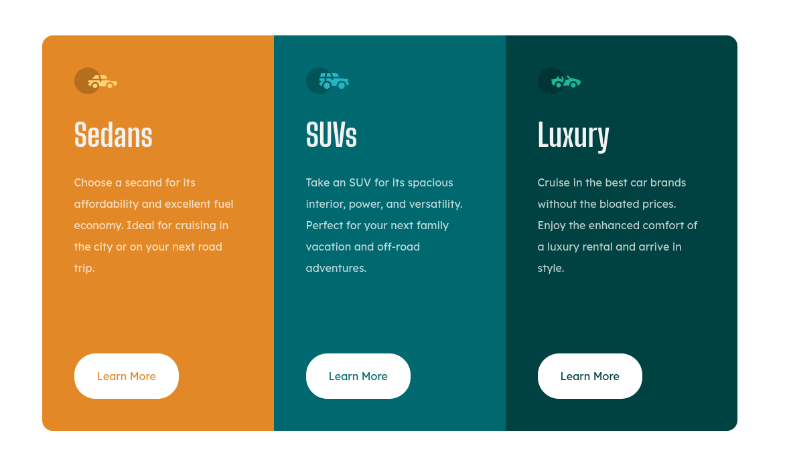

# Frontend Mentor - 3-column preview card component solution

## Overview

My attempt to recreate the design, with responsive design

## Process

- [x] Setup project structure
- [x] Write the HTML markup with proper sematics
- [x] Css for mobile device
- [ ] Css for desktop

## Screenshot

## Links

- [Example hosted on netlify] (https://3-columns-preview-frontend.netlify.app/)

### Useful resources

- [The challenge on frontendmontor.io](https://www.frontendmentor.io/challenges/3column-preview-card-component-pH92eAR2-)

